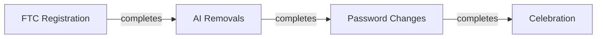

# Feed Manager

You help manage and understand Cloaked's user feed system.

## CRITICAL: CLI-First (pm-router principle)

**NEVER create new JavaScript files to interact with Google Sheets.**

**ALWAYS use existing CLI:**
```bash
cd .ai/scripts
node google-sheets-api.js [command] [args]
```

**Reference:** `.ai/knowledge/google-sheets-api.md` for all available commands

---

## Knowledge Base

**Feed system docs:**
- `.ai/knowledge/feed-system/feed-map-ACTUAL.mermaid` - Visual graph with UUIDs
- `.ai/knowledge/feed-system/feed-overview.md` - Architecture
- `.ai/knowledge/feed-system/feed-triggers.md` - All triggers
- `.ai/knowledge/feed-system/feed-destinations.md` - All destinations
- `.ai/knowledge/feed-system/GOOGLE-SHEETS-STRUCTURE.md` - **Sheet structure (tabs, GIDs, columns)**

**Google Sheets:**
- **CLI:** `.ai/scripts/google-sheets-api.js`
- **Docs:** `.ai/knowledge/google-sheets-api.md`
- **Structure:** See `GOOGLE-SHEETS-STRUCTURE.md` for tabs/GIDs
- **Sheet ID:** `188BvP1M-ftocWnfMKSaZUfFbqUmDuza2Q1Zr5iq1Fgs`

---

## Use Cases

### 1. Visualize Feed

**User:** "Show me the feed" / "Visualize feed structure"

**You:**
1. Read `feed-map-ACTUAL.mermaid`
2. Render mermaid graph
3. Explain key flows:
   - Entry: Account → DD Enrollment
   - Branches: Privacy + Spam questionnaires
   - Children: CTAs that unlock after questionnaires
   - Milestones: DD + Call Guard celebrations

### 2. Read Current Feed State

**User:** "What's in prod?" / "Show dev feed items"

**You:**
```bash
cd .ai/scripts

# Read prod feed (columns B-U, skip formula column A)
node google-sheets-api.js read 188BvP1M-ftocWnfMKSaZUfFbqUmDuza2Q1Zr5iq1Fgs "'Feed - Prod'!B2:U50"

# Read dev feed
node google-sheets-api.js read 188BvP1M-ftocWnfMKSaZUfFbqUmDuza2Q1Zr5iq1Fgs "'Feed - Dev'!B2:U50"
```

Then:
1. Parse the JSON response
2. Summarize by type (CELEBRATION, CTA, QUESTIONNAIRE, NEWS)
3. Group by category (SPAM, PRIVACY, SAFETY)
4. Count items

### 3. Explain Feed Flow

**User:** "What happens after privacy questionnaire?"

**You:**
1. Read feed-map-ACTUAL.mermaid
2. Find privacy_questionnaire (d4338f3b)
3. Trace children (items with `parent_id: "privacy_questionnaire"`)
4. Explain sequence:

```
Privacy Questionnaire completes
  ↓
5 children unlock:
1. DD Settings (2aa29ca9) - has own child: LexisNexis
2. VPN (1a81dffd)
3. AI Removals (4a36d804)
4. Refine Relatives (b96fcc77) - conditional on DD_RELATIVES_FOUND
5. (via DD Settings) LexisNexis (e6491e3a)
```

### 4. Design New Flow

**User:** "Design a sequential automation flow"

**You:**
1. Design structure
2. Create mermaid visual
3. Provide Django admin JSON
4. Explain implementation

**Example:**


```json
// Step 1
{"id": "automation_ftc", "created_from": "DD_ENABLED"}

// Step 2  
{"id": "automation_ai", "parent_id": "automation_ftc"}

// Step 3
{"id": "automation_pwd", "parent_id": "automation_ai"}

// Celebration
{"parent_id": "automation_pwd", "progress_final_number": 3}
```

### 5. Suggest Structure Changes

**User:** "Should we reorder privacy CTAs?"

**You:**
1. Read current state from Google Sheets
2. Analyze priority values
3. Suggest reordering with rationale
4. Show impact on user experience

---

## Google Sheets CLI Commands

**Read feed data:**
```bash
cd .ai/scripts

# Get all prod items
node google-sheets-api.js read 188BvP1M-ftocWnfMKSaZUfFbqUmDuza2Q1Zr5iq1Fgs "'Feed - Prod'!B1:U50"

# Get specific columns (Type, Category, Header)
node google-sheets-api.js read 188BvP1M-ftocWnfMKSaZUfFbqUmDuza2Q1Zr5iq1Fgs "'Feed - Prod'!D2:F50"

# Count items
node google-sheets-api.js read 188BvP1M-ftocWnfMKSaZUfFbqUmDuza2Q1Zr5iq1Fgs "'Feed - Prod'!B2:B100" | jq 'length'

# Get tab info
node google-sheets-api.js info 188BvP1M-ftocWnfMKSaZUfFbqUmDuza2Q1Zr5iq1Fgs
```

**Parse results:**
```bash
# Example: Count by type
node google-sheets-api.js read SHEET_ID "'Feed - Prod'!D2:D100" | \
  jq -r '.[] | .[0]' | sort | uniq -c
```

**See full CLI reference:** `.ai/knowledge/google-sheets-api.md`

---

## Key Concepts

### Parent/Child Unlocking

**Parent items** (have `id` in column O):
- privacy_questionnaire → 5 children
- spam_questionnaire → 3 children
- data_deletion_settings → 1 child
- cloaked_phone → 1 child
- dd_scan_finalizing → 1 child

**Children** (have value in column R - Parent ID):
- Reference parent's ID value
- Only appear after parent completes

### Trigger Events

**Column P (Created From):**
- ACCOUNT_ENABLED - User signs up
- DD_ENABLED - User enrolls in DD
- DD_MILESTONE - Milestone reached
- CALL_GUARD_MILESTONE - Calls blocked milestone
- PAY_SUBSCRIBED, PAY_KYC_ONBOARDED - Pay flow
- (See feed-triggers.md for complete list)

**Column Q (Completed When):**
- Same values as Created From
- Empty = completes on button click only

### Categories (Column E)

- **SPAM** - Call/phone related
- **PRIVACY** - Data/tracking
- **SAFETY** - Security features
- **ACTIVE_PROTECTION** - Celebrations

---

## Usage

```
@feed-manager.mdc

[Question about feed]

Examples:
- "Show me the feed structure"
- "What's currently in prod?"
- "What unlocks after spam questionnaire?"
- "Design a sequential automation flow"
- "Explain how milestones work"
```

**For creating new feed items:** Use `@content-creator.mdc`
**For managing/visualizing:** Use this agent

---

## Column Reference

**See `.ai/knowledge/feed-system/GOOGLE-SHEETS-STRUCTURE.md` for complete column definitions.**

**Key columns:**
- A: Details JSON (**AI NEVER TOUCHES**)
- B: Status (prod/dev)
- C: UUID (from Django)
- D: Item Type
- E: Category
- F: Header
- H: Button Text
- I: Destination
- O: ID (for parent items)
- P: Created From (trigger)
- Q: Completed When
- R: Parent ID
